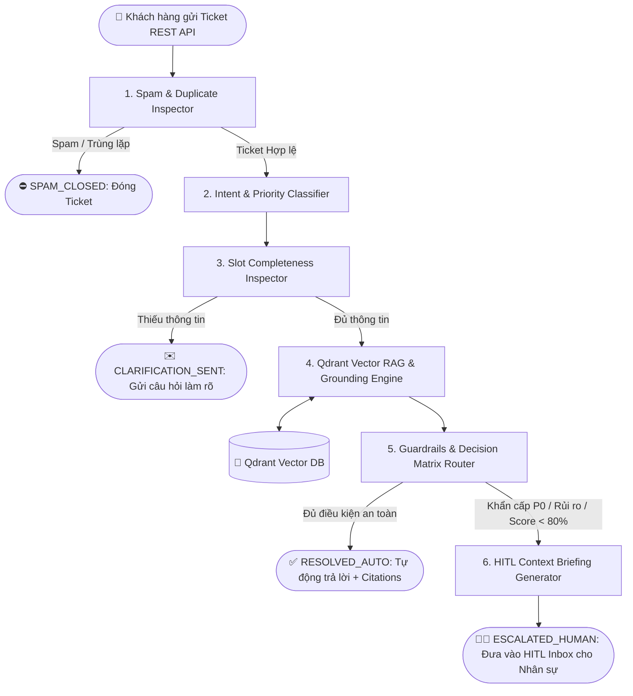

# 📘 TÀI LIỆU KỸ THUẬT & HƯỚNG DẪN HỆ THỐNG
## AUTOMATION/AGENT — Tổng Đài Hỗ Trợ Tự Vận Hành

---

## 📌 1. Tổng Quan Hệ Thống (System Overview)

Hệ thống **Automation/Agent Tổng đài Hỗ trợ Tự vận hành** là giải pháp chăm sóc khách hàng tự động ứng dụng kiến trúc **Multi-Agent State Machine (LangGraph)** kết hợp **Vector Search Engine (Qdrant)** và **Human-in-the-Loop (HITL)**. 

### Bài toán giải quyết:
1. **Giảm tải cho đội ngũ hỗ trợ (Deflection Rate)**: Tự động phân loại và phản hồi ngay lập tức cho các câu hỏi phổ biến (FAQ, quy trình chuẩn) với độ chính xác cao.
2. **Đảm bảo an toàn & giảm rủi ro (Guardrails & Safety)**: Tự động nhận diện rủi ro (khiếu nại gay gắt, sự cố khẩn cấp P0, lỗi giao dịch tài chính) để chuyển giao nhân sự xử lý thay vì cho AI tự trả lời sai.
3. **Tránh AI Hallucination (Grounding & Citations)**: Tất cả câu trả lời tự động đều đi kèm trích dẫn nguồn tri thức chính xác (`[Nguồn: Document - Mục X]`) từ Qdrant Vector Database.
4. **Tối ưu trải nghiệm Nhân sự (AI Context Briefing)**: Khi cần con người can thiệp, hệ thống tự động tổng hợp tóm tắt lịch sử, thái độ khách hàng, hành động đề xuất và bản thảo phản hồi (Draft Response).

---

## 📐 2. Kiến Trúc Luồng Xử Lý (LangGraph Pipeline Architecture)

Luồng xử lý ticket trải qua **6 Tầng xử lý chuyên biệt (Nodes)** kết hợp cùng các rẽ nhánh điều kiện (Conditional Edges):



---

## 🗂️ 3. Mô Hình Dữ Liệu & Trạng Thái (State Management)

Toàn bộ thông tin được truyền và cập nhật qua `SupportState` trong LangGraph (định nghĩa tại [`app/graph/state.py`](file:///f:/GFT/app/graph/state.py)).

### 3.1. `SupportState` (TypedDict)
| Thuộc tính | Kiểu dữ liệu | Mô tả |
| :--- | :--- | :--- |
| `ticket_id` | `str` | Mã định danh ticket (VD: `TCK-8192`) |
| `customer_name` | `str` | Tên khách hàng gửi yêu cầu |
| `customer_email` | `str` | Email liên hệ |
| `channel` | `str` | Kênh tiếp nhận (`web`, `email`, `zalo`, `internal`) |
| `subject` | `str` | Tiêu đề ticket |
| `content` | `str` | Nội dung chi tiết ticket |
| `category` | `str` | Nhóm yêu cầu (`faq`, `technical`, `billing`, `complaint`, `incomplete`, `urgent`, `spam`) |
| `priority` | `str` | Mức độ ưu tiên (`P0_CRITICAL`, `P1_HIGH`, `P2_MEDIUM`, `P3_LOW`) |
| `status` | `str` | Trạng thái ticket (`NEW`, `SPAM_CLOSED`, `CLARIFICATION_SENT`, `RESOLVED_AUTO`, `ESCALATED_HUMAN`, `RESOLVED_HUMAN`) |
| `missing_slots` | `List[str]` | Danh sách tham số còn thiếu |
| `clarification_question` | `str` | Câu hỏi tự động phản hồi để làm rõ |
| `citations` | `List[GroundingCitation]` | Danh sách trích dẫn tri thức từ Qdrant |
| `confidence_score` | `float` | Điểm tin cậy RAG (0% - 100%) |
| `context_package` | `Optional[ContextPackage]` | Gói thông tin AI Briefing cho nhân sự |
| `ai_answer` | `str` | Nội dung câu trả lời tự động |
| `is_spam` | `bool` | Đánh dấu rác/spam |
| `pipeline_logs` | `List[PipelineLog]` | Nhật ký các bước đã chạy trong pipeline |

---

## ⚙️ 4. Chi Tiết Các Nodes & Logic Phân Nhánh

### Node 1: `spam_duplicate_detector_node`
- **Chức năng**: Quét từ khóa SPAM, lừa đảo, quảng cáo hoặc yêu cầu trùng lặp.
- **Rẽ nhánh**: Nếu `is_spam == True` -> Trạng thái `SPAM_CLOSED`, dừng pipeline (`END`). Nguợc lại chuyển sang Node 2.

### Node 2: `intent_priority_classifier_node`
- **Chức năng**: Phân loại 8 nhóm Intent và gán mức độ ưu tiên theo ma trận rủi ro:
  - `urgent` -> `P0_CRITICAL` (Khẩn cấp, sập hệ thống).
  - `billing` / `complaint` -> `P1_HIGH` (Bức xúc, hoàn tiền, tranh chấp).
  - `technical` / `incomplete` -> `P2_MEDIUM` (Lỗi Kỹ thuật, Lỗi 403/500).
  - `faq` -> `P3_LOW` (Hỏi đáp chung, gói cước).

### Node 3: `slot_completeness_inspector_node`
- **Chức năng**: Kiểm tra thông tin bắt buộc theo từng nhóm Intent.
- **Rẽ nhánh**: Nếu nhóm `incomplete` (VD: thiếu IP Client, thiếu 4 số cuối API Key) -> Sinh `clarification_question`, gán trạng thái `CLARIFICATION_SENT` và dừng pipeline (`END`).

### Node 4: `qdrant_rag_retrieval_node`
- **Chức năng**: Thực hiện Vector Search lên Qdrant DB dựa trên `subject` + `content`.
- **Đầu ra**: Trích xuất 3 chunks tri thức có độ tương đồng cao nhất (`GroundingCitation`) và tính điểm `confidence_score`.

### Node 5: `guardrails_router_node`
- **Chức năng**: Router đánh giá ngưỡng an toàn theo tiêu chí:
  - Nếu `priority == "P0_CRITICAL"` HOẶC `category in ["complaint", "billing", "urgent"]` HOẶC `confidence_score < 80%`:
    -> Trạng thái `ESCALATED_HUMAN`, chuyển sang Node 6.
  - Ngược lại (Safe case & Score >= 80%):
    -> Sinh câu trả lời tự động kèm trích dẫn nguồn `[Nguồn: ...]` và gán trạng thái `RESOLVED_AUTO` (`END`).

### Node 6: `hitl_briefing_generator_node`
- **Chức năng**: Tạo `context_package` chứa tóm tắt yêu cầu, phân tích cảm xúc (Sentiment), các bước AI đã tra cứu, hành động đề xuất và câu trả lời mẫu cho nhân sự phê duyệt.

---

## 🐳 5. Engine Vector Database Qdrant (`app/services/qdrant_service.py`)

`QdrantKBEngine` quản lý việc lưu trữ và tra cứu tri thức vector:
1. **Kết nối linh hoạt**: Tự động kết nối tới Qdrant Docker (`http://localhost:6333`). Nếu không có Server, hệ thống tự động chuyển sang chế độ **`In-Memory (:memory:)`** giúp ứng dụng luôn chạy ổn định mà không bị rào cản môi trường.
2. **Collection Spec**:
   - Collection Name: `knowledge_base`
   - Vector Dimension: `384` (Chuẩn embedding nhẹ)
   - Distance Metric: `Cosine`
3. **Khởi tạo dữ liệu mẫu (Seed Knowledge)**: Khi khởi chạy, tự động nạp 4 bộ tài liệu chính sách:
   - `KB-POL-001`: Chính sách Hoàn tiền & Hủy dịch vụ năm 2026
   - `KB-TECH-002`: Hướng dẫn Xử lý Sự cố API & Lỗi 500 / 403
   - `KB-PRICE-003`: Bảng giá Gói cước Enterprise & SLA
   - `KB-SEC-004`: Quy trình Xử lý Sự cố Khẩn cấp P0

---

## 📡 6. Danh Sách RESTful APIs (`app/api/router.py`)

| Phương thức | Endpoint | Mô tả | Body / Query |
| :--- | :--- | :--- | :--- |
| `POST` | `/api/tickets` | Khởi tạo Ticket mới & kích hoạt LangGraph Pipeline | `TicketCreateRequest` |
| `GET` | `/api/tickets` | Lấy danh sách tất cả các ticket | - |
| `GET` | `/api/tickets/{ticket_id}` | Lấy chi tiết ticket & nhật ký xử lý | `ticket_id` |
| `GET` | `/api/hitl/tickets` | Lấy danh sách ticket chờ Nhân sự xử lý (HITL Inbox) | - |
| `POST` | `/api/hitl/resolve` | Nhân sự phê duyệt hoặc cập nhật phản hồi cho ticket | `HITLResolveRequest` |
| `POST` | `/api/kb/documents` | Nạp và vectorize tài liệu mới vào Qdrant Vector Collection | `KBDocCreateRequest` |
| `GET` | `/api/dashboard/metrics` | Lấy các chỉ số báo cáo vận hành (Deflection Rate, Escalation Rate) | - |

---

## 🚀 7. Hướng Dẫn Vận Hành & Khởi Chạy

### 7.1. Khởi tạo môi trường với `uv`
```powershell
# Sync và cài đặt venv tự động
uv sync
```

### 7.2. Khởi chạy Backend Server
```powershell
# Chạy Backend FastAPI trên port 8000
uv run python run.py
```

### 7.3. Truy cập các giao diện
- **Swagger Interactive API Docs**: [http://localhost:8000/docs](http://localhost:8000/docs)
- **Web Demo Dashboard**: Mở trực tiếp file [`index.html`](file:///f:/GFT/index.html) bằng trình duyệt web.

---

## 🛠️ 8. Hướng Dẫn Mở Rộng Hệ Thống (Extensibility)

### Tích hợp LLM Thực tế (OpenAI / Gemini / Ollama)
Hiện tại hệ thống sử dụng các Rule/Template heuristic trong các node để phản hồi nhanh. Để tích hợp LLM thực tế:
1. Cài đặt thư viện: `uv add langchain-openai langchain-google-genai`
2. Cấu hình API Key trong file `.env` (VD: `OPENAI_API_KEY`, `GEMINI_API_KEY`).
3. Thay thế logic trong các node ([`app/graph/nodes.py`](file:///f:/GFT/app/graph/nodes.py)):
   - Trong `qdrant_rag_retrieval_node`: Thay `_simple_embedding` bằng `OpenAIEmbeddings()` hoặc `GoogleGenerativeAIEmbeddings()`.
   - Trong `intent_priority_classifier_node`: Gọi LLM với `structured_output` (Pydantic model) để phân loại câu hỏi phức tạp.
   - Trong `guardrails_router_node`: Dùng LLM RAG Chain để tự động tổng hợp câu trả lời dựa trên `citations`.
