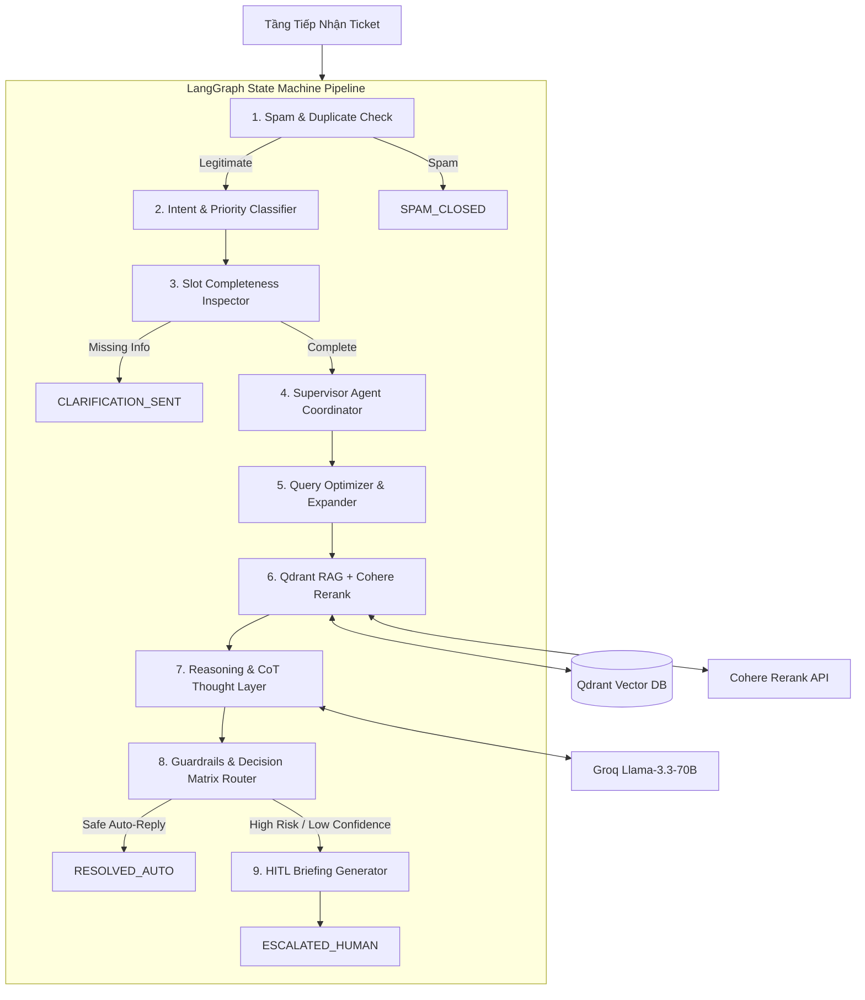

# 🤖 GFT — Autonomous Customer Support Agent System

Hệ thống Tổng Đài Hỗ Trợ Khách Hàng Tự Vận Hành nâng cao ứng dụng kiến trúc **LangGraph Multi-Agent State Machine**, **Qdrant Vector Database**, **SentenceTransformers Semantic Embedding**, **Cohere Rerank**, **Groq Cloud Llama-3.3-70B** và giao diện **Streamlit Role-Based Dashboard**.

---

## 🌟 Ý Tưởng & Kiến Trúc Hệ Thống (Core Concept)

Hệ thống tiếp nhận yêu cầu hỗ trợ đa kênh (*Website, Email, Zalo, Internal*), tự động thực hiện quy trình xử lý thông minh qua 9 nút (nodes) Multi-Agent:



### 🧠 Các Nút Xử Lý Chi Tiết:

1. **Spam & Duplicate Inspector**: LLM Agent kiểm tra rác, quảng cáo lừa đảo hoặc nội dung vô nghĩa với `json_mode=True`.
2. **Intent & Priority Classifier**: LLM Agent phân loại yêu cầu (`faq`, `technical`, `billing`, `urgent`, `complaint`) và ma trận độ ưu tiên (`P0_CRITICAL` đến `P3_LOW`).
3. **Slot Completeness Inspector**: Kiểm tra các trường thông tin bắt buộc và tự động tạo câu hỏi làm rõ (Clarification Loop).
4. **Supervisor Agent Coordinator**: Đưa ra chiến lược xử lý động, quyết định phong cách phản hồi (`formal`, `technical`, `empathetic`) và yêu cầu leo thang.
5. **Query Optimizer & Expander**: Viết lại truy vấn (Query Rewriter) và sinh ra 3 câu truy vấn mở rộng (Query Expansion) bằng thuật ngữ tương đương.
6. **Qdrant RAG & Cohere Reranker Engine**:
   - Semantic Embedding với `sentence-transformers/paraphrase-multilingual-MiniLM-L12-v2` (384 dims, Cosine similarity).
   - Tách đoạn ngữ nghĩa thông minh với `RecursiveCharacterTextSplitter` (chunk_size=800, overlap=150).
   - Point ID ổn định tuyệt đối bằng SHA-256 hash.
   - Tái xếp hạng kết quả bằng Cohere Rerank (`rerank-multilingual-v3.0`).
7. **Reasoning & Thought Layer**: Tạo vết suy luận lập luận từng bước (Chain-of-Thought) trước khi đưa ra câu trả lời chính thức.
8. **Guardrails Matrix Router**: Đánh giá rủi ro và độ tin cậy để điều hướng tự động phản hồi (`RESOLVED_AUTO`) hoặc chuyển giao nhân sự (`ESCALATED_HUMAN`).
9. **HITL Context Briefing Generator**: Soạn thảo gói thông tin tóm tắt cho nhân sự gồm lý do leo thang, thái độ khách hàng, hành động đề xuất và bản nháp trả lời tự động.

---

## 📁 Cấu Trúc Dự Án (Project Structure)

```text
GFT/
├── app/
│   ├── api/
│   │   └── router.py          # FastAPI RESTful Endpoints (Tickets, KB, HITL)
│   ├── config/
│   │   └── settings.py        # Pydantic Settings đọc cấu hình từ .env
│   ├── graph/
│   │   ├── state.py           # SupportState TypedDict cho LangGraph Engine
│   │   ├── nodes.py           # 9 Nodes xử lý Multi-Agent & Guardrails
│   │   └── builder.py         # Lắp ráp StateGraph & MemorySaver Checkpointer
│   ├── prompts/
│   │   └── support_prompts.py # Prompts chuẩn hóa cho các Agent
│   ├── services/
│   │   ├── auth_service.py    # SQLite DB (WAL Mode), Authentication & Ticket Sync
│   │   ├── llm_service.py     # Groq API Service (Retry, Exponential Backoff, JSON Mode)
│   │   └── qdrant_service.py  # Qdrant Vector DB Engine, Embedding & Auto-Seeding
│   └── main.py                # FastAPI Application & /health Probe Endpoint
├── knowledge_base/            # Thư mục chứa 15 file tri thức chuẩn (.txt)
│   ├── billing/
│   ├── emergency/
│   ├── faq/
│   └── technical/
├── app_streamlit.py           # Streamlit Web App (Phân quyền Admin vs Customer)
├── pyproject.toml             # Cấu hình môi trường Python ( Astral uv )
├── Dockerfile                 # Dockerfile tối ưu (Pre-baked Embedding Model)
├── docker-compose.yml         # Container Orchestration (App + Qdrant DB)
├── .env.example               # Mẫu khai báo biến môi trường
└── README.md                  # Tài liệu hướng dẫn hệ thống
```

---

## ⚡ Hướng Dẫn Khởi Chạy (Quickstart)

### Cách 1: Khởi chạy với `uv` (Khuyên dùng cho phát triển Local)

1. **Cài đặt môi trường & dependencies**:
   ```bash
   uv sync
   ```

2. **Cấu hình file `.env`**:
   Tạo file `.env` từ `.env.example` và điền API Keys:
   ```env
   GROQ_API_KEY=gsk_your_groq_api_key_here
   COHERE_API_KEY=your_cohere_api_key_here
   QDRANT_URL=http://localhost:6333
   ```

3. **Khởi chạy Qdrant Docker** *(nếu dùng Qdrant server)*:
   ```bash
   docker run -p 6333:6333 -p 6334:6334 qdrant/qdrant:v1.12.0
   ```

4. **Khởi chạy ứng dụng Streamlit**:
   ```bash
   uv run streamlit run app_streamlit.py
   ```
   *Truy cập ứng dụng tại:* `http://localhost:8501`

5. **Khởi chạy FastAPI Backend (Tùy chọn)**:
   ```bash
   uv run python -m uvicorn app.main:app --reload --port 8000
   ```
   *Truy cập Swagger API Docs tại:* `http://localhost:8000/docs`

---

### Cách 2: Triển khai toàn bộ với Docker Compose (Production Setup)

```bash
# Khởi chạy toàn bộ hệ thống (App + Vector DB Qdrant)
docker-compose up --build -d
```

---

## 🔐 Phân Quyền Nổi Bật Trên Streamlit Dashboard

| Tính Năng | Khách Hàng (Customer) | Nhân Sự / Admin |
|-----------|:---------------------:|:---------------:|
| **Gửi Ticket Hỗ Trợ** | ✅ (Kênh Web, Email, Zalo) | ✅ (Kênh Nội Bộ - Internal) |
| **Kịch Bản Mẫu (Presets)** | ✅ | ✅ |
| **Trích Dẫn Tri Thức (Citations)** | ❌ (Ẩn để bảo mật) | ✅ Hiển thị đầy đủ score & snippet |
| **Bộ Điều Phối Supervisor & Optimizer** | ❌ (Ẩn) | ✅ Hiển thị chi tiết lập luận |
| **Reasoning Trace (Vết Suy Luận)** | ❌ (Ẩn) | ✅ Hiển thị từng bước suy luận CoT |
| **Hàng Chờ Phê Duyệt Escalations** | ❌ | ✅ Phê duyệt & chỉnh sửa câu trả lời |
| **Quản Lý Knowledge Base** | ❌ | ✅ Upload file PDF/Docx/JSON & Index vào Qdrant |

---

## 🛠️ Công Nghệ Sử Dụng

- **Core Engine**: Python 3.10+, Astral `uv`
- **Multi-Agent Framework**: LangGraph (`langgraph`, `langchain-core`, `langchain-text-splitters`)
- **Semantic Embedding**: `sentence-transformers` (`paraphrase-multilingual-MiniLM-L12-v2` - 384 dims)
- **Vector Database**: Qdrant (`qdrant-client` với Cosine Distance & HNSW Index)
- **Reranker Engine**: Cohere Rerank API (`rerank-multilingual-v3.0`)
- **LLM Engine**: Groq Cloud API (`llama-3.3-70b-versatile`)
- **Persistence & Auth**: SQLite 3 (WAL Journal Mode & Busy Timeout)
- **UI & Web Framework**: Streamlit, FastAPI, Uvicorn, Pydantic v2
