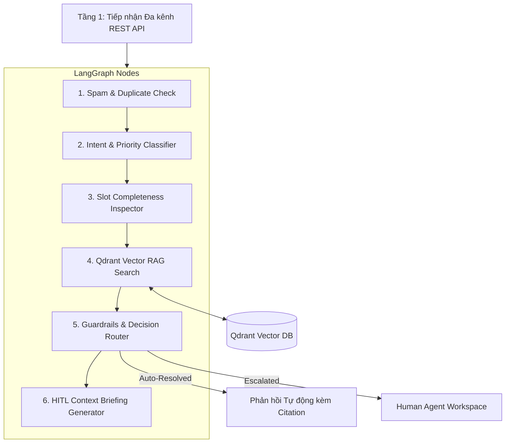

# 🤖 AUTOMATION/AGENT — Tổng đài Hỗ trợ Tự vận hành

Hệ thống Chăm sóc Khách hàng Tự vận hành ứng dụng kiến trúc **LangGraph State Machine Multi-Agent**, **Vector Database Qdrant** và quản lý môi trường bằng **`uv`**.

---

## 🌟 Ý tưởng & Kiến trúc Hệ thống (Core Concept)

Hệ thống tiếp nhận yêu cầu hỗ trợ đa kênh (Website, Email, Zalo/Messenger, Hệ thống Nội bộ), tự động phân loại, kiểm tra độ tin cậy tri thức từ Qdrant Vector DB kèm dẫn nguồn (Citations), tự động trả lời với case an toàn và chuyển giao cho nhân sự (Human-in-the-Loop) khi phát hiện rủi ro hoặc sự cố khẩn cấp.

### 5 Tầng Xử Lý Multi-Agent:



1. **Spam & Duplicate Inspector**: Lọc rác và ticket trùng lặp.
2. **Intent & Priority Classifier**: Phân loại 8 nhóm yêu cầu (`FAQ`, `Khiếu nại`, `Kỹ thuật`, `Thanh toán`, `Khẩn cấp P0`, `Spam`, `Trùng lặp`, `Thiếu thông tin`) và ma trận độ ưu tiên (`P0_CRITICAL` đến `P3_LOW`).
3. **Slot Completeness Inspector**: Kiểm tra missing parameters và kích hoạt Clarification Loop tự động làm rõ.
4. **Qdrant Vector RAG Search**: Tra cứu Vector Search trên Qdrant DB, tính Grounding Confidence Score % và trích dẫn nguồn `[Nguồn: Document - Mục X]`.
5. **Guardrails Router & HITL Briefing**: Router quyết định tự động trả lời hay chuyển giao sang Nhân sự kèm **AI Context Briefing Package**.

---

## 📁 Cấu trúc Dự án (Project Structure)

```text
F:\GFT
├── app/
│   ├── api/
│   │   └── router.py          # RESTful APIs (Tickets, Qdrant KB, HITL, Dashboard)
│   ├── graph/
│   │   ├── state.py           # SupportState TypedDict cho LangGraph
│   │   ├── nodes.py           # 6 Nodes xử lý Multi-Agent
│   │   └── builder.py         # StateGraph builder & Checkpointer
│   ├── services/
│   │   └── qdrant_service.py  # Qdrant Client, HNSW Vector Collection & RAG Search
│   └── main.py                # FastAPI Application & Startup Event
├── pyproject.toml             # Cấu hình môi trường Python 3.10+ quản lý bởi uv
├── uv.lock                    # Dependency lockfile sinh bởi uv
├── run.py                     # Script khởi chạy nhanh Backend Server
├── index.html                 # Giao diện Dashboard Web Demo tương tác
└── README.md                  # Tài liệu hướng dẫn hệ thống
```

---

## ⚡ Hướng dẫn Khởi chạy (Usage Guide)

### 1. Cài đặt Dependencies với `uv`
```powershell
# Cài đặt môi trường & thư viện tự động từ pyproject.toml
uv sync
```

### 2. Khởi chạy Backend Server & API
```powershell
# Khởi chạy ứng dụng FastAPI + LangGraph + Qdrant
uv run python run.py
```

### 3. Khởi chạy Giao diện Demo với Streamlit
```powershell
# Khởi chạy ứng dụng Streamlit Dashboard
uv run streamlit run app_streamlit.py
```

- **Swagger API Docs**: `http://localhost:8000/docs`
- **Giao diện Streamlit App**: `http://localhost:8501`
- **Giao diện Web HTML Demo**: Mở file [index.html](file:///f:/GFT/index.html) bằng trình duyệt web.

---

## 🛠️ Công nghệ Sử dụng
- **Python**: 3.10+
- **Environment & Dependency Manager**: Astral `uv`
- **Multi-Agent State Machine**: LangGraph (`langgraph`, `langchain-core`)
- **Vector Database**: Qdrant (`qdrant-client` với HNSW Index & Cosine Distance)
- **Web API & Dashboard Engine**: FastAPI (`uvicorn`, `pydantic`), Streamlit (`streamlit`)

uv run python -m streamlit run app_streamlit.py
