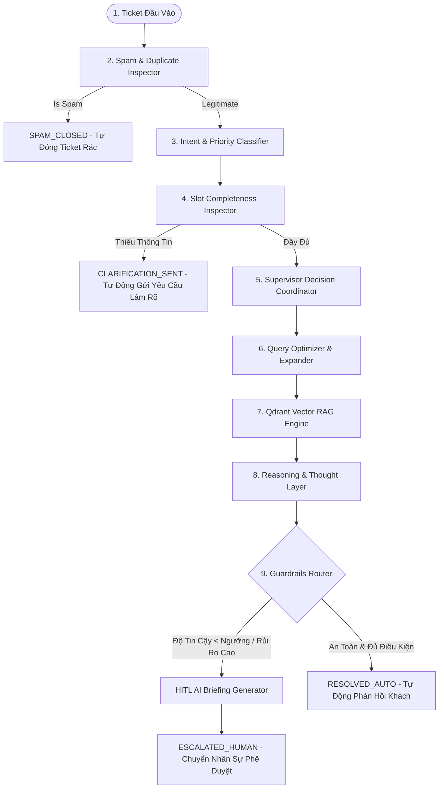

# 🧭 TÀI LIỆU TÓM TẮT KIẾN TRÚC HỆ THỐNG
## Autonomous Customer Support Agent System (Multi-Agent & Advanced RAG)

---

## 1. TỔNG QUAN HỆ THỐNG

Hệ thống **Tổng Đài Hỗ Trợ Tự Vận Hành (Autonomous Customer Support Agent System)** được thiết kế theo kiến trúc **Multi-Agent State Machine (LangGraph)** kết hợp **Advanced Vector RAG (Qdrant DB + SentenceTransformers + Cohere Rerank)** và quy trình **Human-in-the-Loop (HITL)**.

Hệ thống có khả năng tự động xử lý, phân loại, tìm kiếm tri thức ngữ nghĩa, suy luận logic từng bước (Chain-of-Thought), đánh giá mức độ rủi ro nghiệp vụ và ra quyết định tự động phản hồi hoặc chuyển giao cho Nhân sự hỗ trợ phê duyệt chỉ với 1-click.

---

## 2. KIẾN TRÚC MULTI-AGENT PIPELINE (LANGGRAPH STATE MACHINE)

Toàn bộ vòng đời của một Ticket hỗ trợ trải qua 9 node xử lý độc lập trong LangGraph State Graph:



### Chi Tiết Chức Năng 9 Node Trong Graph:

1. **Spam & Duplicate Inspector (`spam_check`)**:
   * Sử dụng LLM Agent phân tích nội dung rác, quảng cáo lừa đảo, spam crypto hoặc các chuỗi vô nghĩa.
   * Nếu là Spam ➔ Gán trạng thái `SPAM_CLOSED` và kết thúc ngay luồng xử lý.

2. **Intent & Priority Classifier (`classify`)**:
   * Phân loại động nhóm sự cố: `urgent`, `billing`, `technical`, `incomplete`, `faq`, `spam`.
   * Gán độ ưu tiên: `P0_CRITICAL` (Khẩn cấp/Sập hệ thống), `P1_HIGH` (Khiếu nại/Lỗi thanh toán), `P2_MEDIUM` (Lỗi API/Kỹ thuật), `P3_LOW` (FAQ/Hỏi đáp).

3. **Slot Completeness Inspector (`slot_check`)**:
   * Kiểm tra tính đầy đủ của dữ liệu bắt buộc (VD: Lỗi 403 API thiếu 4 ký tự cuối API Key hoặc IP Client).
   * Nếu thiếu ➔ Chuyển sang trạng thái `CLARIFICATION_SENT` kèm câu hỏi tự động làm rõ thông tin.

4. **Supervisor Decision Coordinator (`supervisor`)**:
   * Agent Đóng vai trò Trưởng ca điều phối luồng hỗ trợ.
   * Quyết định phong cách giao tiếp (`formal`, `technical`, `empathetic`), độ sâu lập luận (`shallow`, `deep`), và đánh giá rủi ro nghiệp vụ để đặt cờ `escalation_required`.

5. **Query Optimizer & Expander (`query_optimize`)**:
   * Viết lại câu hỏi tự nhiên dài của khách hàng thành `rewritten_query` cô đọng.
   * Mở rộng thêm 3 câu truy vấn phụ (`expanded_queries`) chứa thuật ngữ kỹ thuật tương đương để tối đa hóa khả năng tìm kiếm tri thức.

6. **Qdrant Vector RAG & Grounding Engine (`rag_search`)**:
   * Tìm kiếm Multi-Query song song trên Qdrant Vector DB.
   * Sử dụng mô hình **`SentenceTransformers (paraphrase-multilingual-MiniLM-L12-v2)`** sinh vector 384 dimensions.
   * Sử dụng **`Cohere Rerank v3`** để tái xếp hạng (Rerank) lại danh sách tài liệu.

7. **Reasoning & Thought Layer (`reasoning`)**:
   * Thực hiện suy luận logic Chain-of-Thought (CoT) 3 bước: *Phân tích thực tế lỗi ➔ Đối chiếu tài liệu tri thức RAG ➔ Xác định giải pháp*.
   * Dự thảo câu phản hồi hoàn chỉnh.

8. **Guardrails & Decision Matrix Router (`guardrails`)**:
   * Đánh giá ma trận an toàn 2 lớp:
     * **Lớp 1 (Rủi ro)**: Sự cố `P0_CRITICAL`, nhóm `complaint`/`urgent`, hoặc `supervisor_decision.escalation_required == True` (Ví dụ: Bị trừ tiền 2 lần, đòi hoàn tiền).
     * **Lớp 2 (Tin cậy)**: Confidence Score < Ngưỡng thiết lập (Mặc định `45.0%`).
   * Phân luồng sang `ESCALATED_HUMAN` hoặc `RESOLVED_AUTO`.

9. **HITL AI Briefing Generator (`briefing`)**:
   * Tự động đóng gói **`ContextPackage`** cho Nhân sự: Tóm tắt 1 câu, Đánh giá thái độ (`Bức xúc`, `Khẩn cấp`), Các bước AI đã thử, Hành động đề xuất, và Bản nháp trả lời hoàn chỉnh.

---

## 3. THIẾT KẾ VECTOR RAG PIPELINE & CHUNKING

```
[Văn bản Tri thức KB] 
       │
       ▼
[RecursiveCharacterTextSplitter] (Chunk size: 800, Overlap: 150)
       │
       ▼
[SentenceTransformer] (paraphrase-multilingual-MiniLM-L12-v2, 384 dims)
       │
       ▼
[Qdrant Vector DB] (HNSW Index, Cosine Distance, Deterministic SHA-256 Point IDs)
       │
       ▼
[Cohere Rerank v3.0] (rerank-multilingual-v3.0)
       │
       ▼
[Grounding Citations & Score Calibration]
```

### Các Kỹ Thuật RAG Đã Triển Khai:
* **Semantic Chunking**: Chia đoạn bằng `RecursiveCharacterTextSplitter` với danh sách phân cách ưu tiên ngữ nghĩa `["\n===", "\n---", "\n\n", "\n", "."]`. Overlap 150 ký tự (~20%) giữ vẹn nguyên ngữ nghĩa liên tục.
* **Deterministic Point IDs**: Sử dụng `hashlib.sha256(f"{doc_id}_chunk_{idx}")` đảm bảo tính ổn định của ID khi re-upsert, chống trùng lặp dữ liệu.
* **Confidence Score Calibration**: Chuẩn hóa toán học dạng piece-wise mapping từ Cosine Similarity/Rerank score về phần trăm trung thực từ 0% đến 99%.

---

## 4. BẢO MẬT & LƯU TRỮ DỮ LIỆU (DATABASE & PERSISTENCE)

* **SQLite Database (`user.db`)**: Lưu trữ bền vững tài khoản người dùng và toàn bộ thuộc tính ticket.
* **WAL Mode (Write-Ahead Logging)**: Kích hoạt `PRAGMA journal_mode=WAL;` và `PRAGMA busy_timeout=5000;` cho phép nhiều luồng đọc đồng thời trong khi đang ghi, giải quyết hoàn toàn lỗi `database is locked` trên Streamlit multi-user.
* **Đồng Bộ ON CONFLICT**: Cập nhật toàn bộ 16 trường thuộc tính ticket khi có thay đổi từ AI hoặc Nhân sự.
